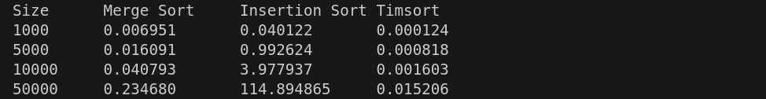

### Завдання ([task.py](task.py))

Python має дві вбудовані функції сортування: sorted і sort. Функції сортування Python використовують Timsort — гібридний алгоритм сортування, що поєднує в собі сортування злиттям і сортування вставками.

Порівняйте три алгоритми сортування: злиттям, вставками та Timsort за часом виконання. Аналіз повинен бути підтверджений емпіричними даними, отриманими шляхом тестування алгоритмів на різних наборах даних. Емпірично перевірте теоретичні оцінки складності алгоритмів, наприклад, сортуванням на великих масивах. Для заміру часу виконання алгоритмів використовуйте модуль timeit.

Покажіть, що поєднання сортування злиттям і сортування вставками робить алгоритм Timsort набагато ефективнішим, і саме з цієї причини програмісти, в більшості випадків, використовують вбудовані в Python алгоритми, а не кодують самі. Зробіть висновки.

------------------------------------------------------------------------------------------------------------------------------------------------------------

Згідно з даними конспекту курсу ми маємо наступне:

#### Merge Sort:
 - Часова складність: O(n log n)
 - Просторова складність: O(n)

#### Insertion Sort:
 - Часова складність: O(n²) у гіршому випадку, O(n) у найкращому випадку (майже відсортовані дані).
 - Просторова складність: O(1)

### Timsort:
 - Часова складність: O(n log n) у гіршому випадку, O(n) у найкращому випадку.
 - Просторова складність: O(n)

Після проведення тестування, ([task.py](task.py)) отримаємо наступний результат:

**Size** - кількість даних

**Merge Sort** - час виконання алгоритму злиття

**Insertion Sort** - час виконання алгоритму вставкою

**Timesort** - час комбінованого алгоритму

Отже

**Merge Sort** - дає стабільні результати з точки зору часової складності, але використовує більше пам'яті через необхідність зберігання проміжних масивів.

**Insertion Sort** - ефективне на малих масивах і майже відсортованих даних, але його часові затрати зростають з ростом розміру даних.

**Timsort** - (вбудоване сортування в Python) поєднує переваги обох алгоритмів. Він використовує сортування вставками для малих масивів та сортування злиттям для великих масивів, що робить його надзвичайно ефективним на практиці. Це підтверджується тим, що Timsort значно швидший за будь-який з інших двох алгоритмів для великих масивів.

тому, згідно результатів, використання **Timsort** є найкращим вибором. База!
